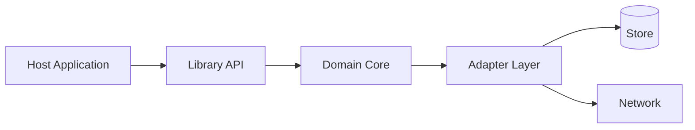
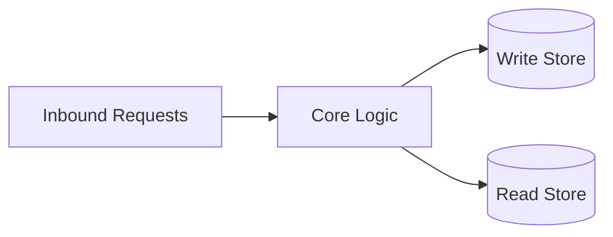
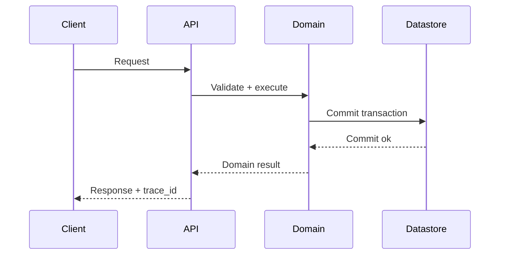
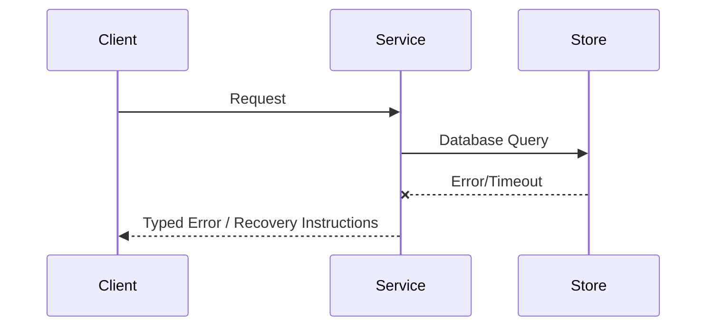

# Architecture

<!-- decapod:capability-overlay:persistent-state:start -->

## Persistent State Architecture Overlay

### State Ownership
- Each entity type MUST have a designated state owner
- State ownership boundaries MUST be explicitly documented
- Cross-boundary state access MUST go through defined interfaces

### Transaction Boundaries
- All multi-entity mutations MUST occur within explicit transactions
- Transaction boundaries MUST be documented in ARCHITECTURE.md
- Compensating transactions for distributed operations

### Storage Abstraction
- Storage ownership, consistency behavior, and access boundaries MUST be explicit
- Portability or swappable implementations are project decisions, not universal requirements
- Migration and rollback treatment MUST match the selected storage technology
<!-- decapod:capability-overlay:persistent-state:end -->

## Direction
cli

## What This Project Is
decapod is a service_or_library project built using Rust, rust.
cli

Architectural principles:
- **Simplicity**: Keep components focused and reusable.
- **Modularity**: Clearly defined interface boundaries and dependency separation.
- **Reliability**: Graceful failure handling and thorough verification.

## Current Facts
- Runtime/languages: Rust, rust
- Detected surfaces/framework hints: cargo, rust
- Product type: service_or_library

## Architecture Map
This project's architecture consists of the following key layers/directories:
- `src/`: Main source directory containing primary logic.
- `tests/`: Integration and unit test suite.

## Data Flows
- Inbound request/command parses and validates at the entrypoint.
- Core runtime handles business logic and initiates queries or state changes.
- Storage adapter reads or writes data to the underlying persistence layers.

## Strongest Existing Primitives
- Define the strongest existing primitives in the codebase (e.g., helper utilities, base controllers, data access layers).

## Topology

## Store Boundaries

## Happy Path Sequence

## Error Path

## Execution Path
- Ingress parse + validation:
- Policy/interlock checks:
- Core execution + persistence:
- Verification and artifact emission:

## Concurrency and Runtime Model
- Execution model:
- Isolation boundaries:
- Backpressure strategy:
- Shared state synchronization:

## Deployment Topology
- Runtime units:
- Region/zone model:
- Rollout strategy (blue/green/canary):
- Rollback trigger and blast-radius scope:

## Data and Contracts
- Inbound contracts (CLI/API/events):
- Outbound dependencies (datastores/queues/external APIs):
- Data ownership boundaries:
- Schema evolution + migration policy:

## Governance Authority and Evidence Boundaries
- Each exact registered directive H3 in `.decapod/OVERRIDE.md` owns a fenced human-authored documentation body. The scaffold uses a four-backtick Markdown source block so headings and nested triple-backtick examples do not render as outer document structure. `core::assets` extracts the wrapper-free body, preserves legacy body bytes during upgrade, and fails the whole overlay on unclosed wrappers, duplicate exact IDs, or non-empty unknown Decapod-namespaced IDs.
- Context resolution and context capsules carry derived authority evidence: directive ID, source path, source hash, body hash, byte count, and precedence.
- `core::events` is the semantic read/write boundary for append-only runtime evidence. Callers do not bind to per-stream tables, a future consolidated table, or legacy JSONL.
- Startup migration reconciles unproven legacy JSONL into canonical `.decapod/data/decapod.db` idempotently before governed consumers run. A successful single-datastore migration is durable proof that its JSONL inputs are retired. If an older binary recreates legacy SQLite stores, startup copies their newer rows forward and removes them before consumers run. Fresh conflicts fail visibly.

## ADR Register
| ADR | Title | Status | Rationale | Date |
|---|---|---|---|---|
| ADR-001 | Initial topology choice | Proposed | Define first stable architecture | YYYY-MM-DD |

## Delivery Plan (first 3 slices)
- Slice 1 (ship first):
- Slice 2:
- Slice 3:

## Risks and Mitigations
| Risk | Likelihood | Impact | Mitigation |
|---|---|---|---|
| Contract drift across components | Medium | High | Spec + schema checks in CI |
| Runtime saturation under peak load | Medium | High | Capacity model + load tests |

<!-- decapod:codebase-attestation:start -->
## Codebase Attestation

- Repository signal fingerprint: `676e1a995fcdfd040a9f75d461a0a648d438053542ddb28d4d73652e7e1d51bd`
- Significant implementation surfaces: `.github/` (9 files), `Cargo.lock/` (1 files), `Cargo.toml/` (1 files), `README.md/` (1 files), `docs/` (1 files), `src/` (101 files), `tests/` (4 files)
- Refreshed from the current codebase by `decapod specs.refresh`
<!-- decapod:codebase-attestation:end -->
